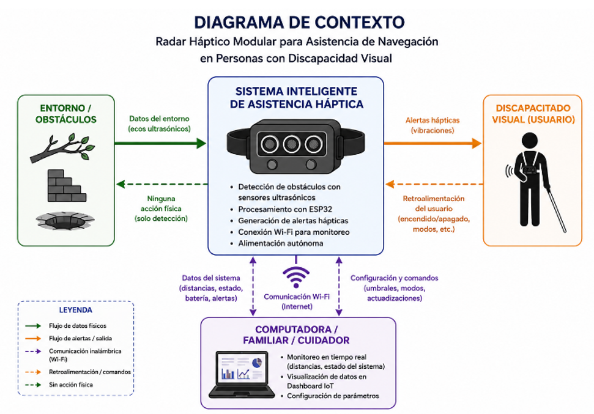
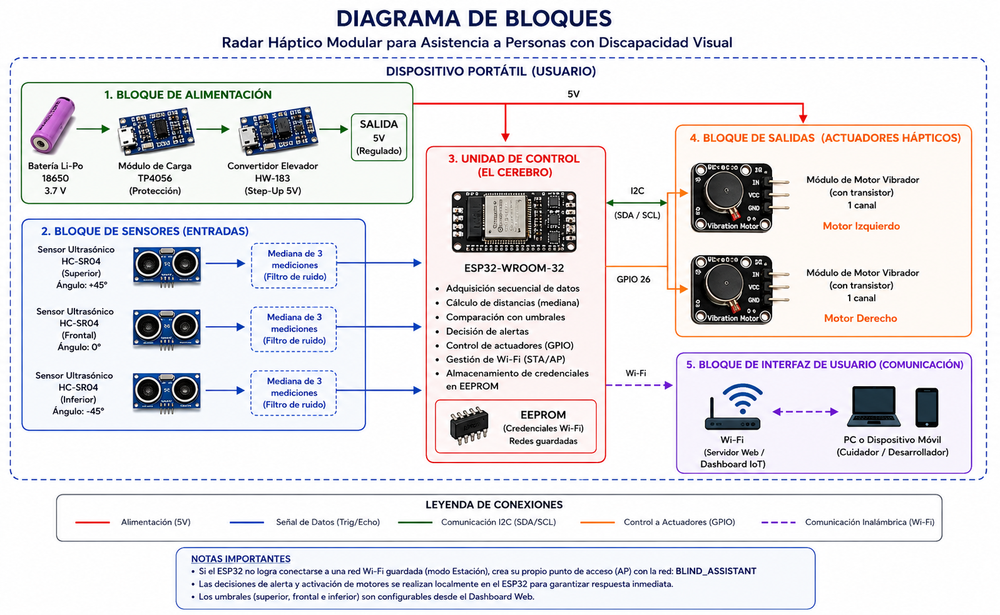
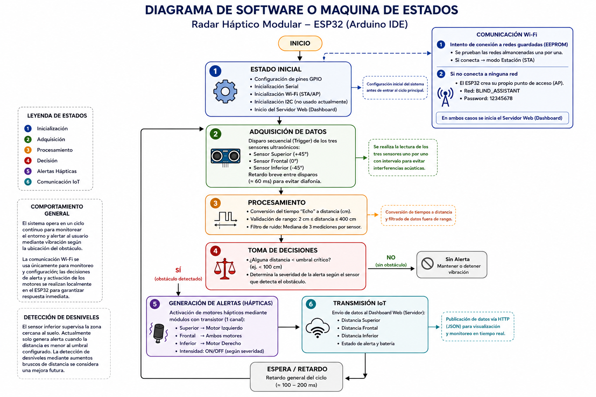

# Documento de Diseño: Radar Háptico Modular para Asistencia de Navegación

## 1. Introducción y Objetivos

Este proyecto consiste en desarrollar un Radar Háptico Modular para ayudar a personas con discapacidad visual durante su desplazamiento. El sistema busca detectar obstáculos mediante sensores ultrasónicos y avisar al usuario mediante vibraciones. La idea es ofrecer una herramienta portátil que ayude a mejorar la seguridad y facilite un poco más la movilidad diaria.

## 2. Alcance y Limitaciones

**Alcance:** El proyecto desarrolla un dispositivo portátil que utiliza tres sensores ultrasónicos HC-SR04 para detectar obstáculos en diferentes zonas. Un ESP32-WROOM procesa las mediciones y controla dos módulos de motores vibradores, uno izquierdo y otro derecho. Además, cuenta con una interfaz web mediante Wi-Fi para visualizar las mediciones y configurar los umbrales de detección.

El sistema también almacena las credenciales de las redes Wi-Fi en la memoria EEPROM. Si no encuentra una red guardada disponible, el ESP32 crea su propia red Wi-Fi para permitir la configuración y conexión directa con el dispositivo.

**Limitaciones:** Este dispositivo no busca reemplazar el bastón blanco ni a un perro guía, sino servir como una ayuda adicional. Puede presentar falsas alertas o dificultades para detectar ciertos materiales debido a las características de los sensores ultrasónicos. Actualmente, el algoritmo del sensor inferior genera una alerta cuando la distancia medida se encuentra por debajo del umbral configurado, por lo que la identificación específica de desniveles o caídas mediante cambios bruscos de distancia puede considerarse una mejora futura. Tampoco incluye funciones de GPS ni instrucciones por voz.

---

## 3. Diagrama de Contexto

El sistema interactúa con el entorno mediante tres sensores ultrasónicos, procesa la información mediante el ESP32-WROOM y proporciona alertas al usuario mediante dos módulos de motores vibradores.

Además, el ESP32 mantiene comunicación Wi-Fi con una computadora o dispositivo móvil para visualizar las mediciones y configurar los umbrales del sistema.

---

## 4. Diagrama de Bloques del Diseño

El diseño se compone de varios subsistemas interconectados:

### Alimentación

Una batería Li-Po de 3.7 V suministra energía al módulo de carga TP4056. Posteriormente, un convertidor elevador HW-183 aumenta la tensión para obtener una alimentación de 5 V para los componentes que lo requieren.

### Entradas (Sensores)

Se utilizan tres sensores ultrasónicos HC-SR04 ubicados en las posiciones superior, frontal e inferior. Estos sensores realizan las mediciones de distancia y envían las señales Trigger y Echo al ESP32-WROOM.

### Unidad de Control

El ESP32-WROOM funciona como unidad principal del sistema. Se encarga de realizar las mediciones, calcular las distancias, aplicar el procesamiento de la mediana, comparar los valores con los umbrales configurados, controlar los motores y administrar la comunicación Wi-Fi.

### Salidas Hápticas

Se utilizan dos módulos de motores vibradores independientes. Cada módulo incorpora su propio motor y circuito de transistor, por lo que pueden ser controlados directamente desde el ESP32.

El motor izquierdo se controla mediante el GPIO 25 y el motor derecho mediante el GPIO 26. Dependiendo del sensor que detecte el obstáculo, se activa el motor izquierdo, el derecho o ambos.

---

## 5. Diagrama de Software o Máquina de Estados

El funcionamiento del software comienza con la configuración de los pines, la comunicación serial y la conexión Wi-Fi. El ESP32 intenta conectarse automáticamente a una red almacenada en la EEPROM. Si no encuentra una red disponible, crea un punto de acceso Wi-Fi para permitir la configuración.

Una vez establecida la conexión, el sistema entra en un ciclo continuo de adquisición y procesamiento.

Para cada sensor se realizan tres mediciones consecutivas y se obtiene la mediana de los valores. Posteriormente, las distancias se comparan con los umbrales configurados:

- Sensor superior: 80 cm inicialmente.
- Sensor frontal: 100 cm inicialmente.
- Sensor inferior: 70 cm inicialmente.

Los valores pueden modificarse desde el dashboard web.

La generación de las alertas se realiza localmente en el ESP32, por lo que no depende de la respuesta del dashboard o de la comunicación Wi-Fi. Esto permite mantener la función principal de alerta incluso si existe una variación o interrupción de la conexión inalámbrica.

El sistema también envía los datos de las mediciones al dashboard para permitir el monitoreo en tiempo real.

---

## 6. Diseño de Interfaces

El sistema presenta dos interfaces principales:

### Interfaz Físico-Humana (Háptica)

La comunicación con el usuario se realiza mediante dos módulos de motores vibradores independientes. Cuando se detecta un obstáculo en la zona superior se activa el motor izquierdo; para la zona frontal se activan ambos motores; y para la zona inferior se activa el motor derecho.

De esta manera, el usuario puede relacionar la vibración con la dirección aproximada del obstáculo sin depender de una interfaz visual.

### Interfaz Web (Dashboard IoT)

El sistema cuenta con una interfaz web accesible desde una computadora o dispositivo móvil conectado a la red del ESP32.

El dashboard muestra las distancias medidas por los tres sensores, el estado de cada zona y permite modificar los umbrales de detección mediante controles deslizantes.

También cuenta con tres configuraciones predefinidas:

- **En Casa**
- **Normal**
- **Exteriores**

La comunicación Wi-Fi se utiliza principalmente para monitoreo y configuración. Las decisiones de activación de los motores se realizan directamente en el ESP32, por lo que la alerta háptica no depende de la respuesta del dashboard.

---

## 7. Alternativas de Diseño

| Componente | Alternativa Descartada | Decisión Implementada y Justificación |
|---|---|---|
| Controlador | Arduino Uno / Nano | **ESP32-WROOM:** elegido por su capacidad de procesamiento y conectividad Wi-Fi integrada, necesaria para el dashboard. |
| Sensor de Proximidad | LiDAR o sensores infrarrojos | **HC-SR04:** elegido por su bajo costo, facilidad de integración y disponibilidad para el prototipo. |
| Alerta al Usuario | Buzzer | **Dos módulos de motores vibradores:** permiten generar alertas hápticas independientes para indicar diferentes direcciones. Además, los módulos ya incorporan el circuito de transistor necesario para controlar los motores. |
| Comunicación | Bluetooth | **Wi-Fi:** implementado debido a que permite utilizar un dashboard web para monitoreo y configuración del sistema. |

Como mejora futura, podría evaluarse el uso de Bluetooth para reducir el consumo energético durante el funcionamiento portátil y sensores ultrasónicos más compactos para disminuir el tamaño del sistema y facilitar su transporte.

---

## 8. Plan de Test y Validación

Para comprobar el funcionamiento del radar modular se realizarán diferentes pruebas:

### Pruebas Individuales de Sensores

Verificar la lectura de distancia de cada HC-SR04 comparándola con mediciones realizadas mediante una cinta métrica.

### Test de Diafonía (Crosstalk)

Comprobar que las mediciones de los tres sensores no interfieran entre sí. Las lecturas se realizan de forma secuencial y se utiliza un pequeño intervalo entre mediciones.

### Validación Háptica

Realizar pruebas con usuarios videntes con los ojos vendados para comprobar que puedan diferenciar la activación del motor izquierdo, derecho o ambos según la ubicación del obstáculo.

### Prueba del Dashboard

Comprobar que las distancias y estados mostrados en la interfaz web coincidan con las mediciones realizadas por los sensores y verificar que los umbrales puedan modificarse correctamente.

### Prueba de Conectividad

Verificar que el ESP32 pueda conectarse automáticamente a una red almacenada y que, cuando no exista una red disponible, pueda crear su propio punto de acceso para realizar la configuración.

---

## 9. Consideraciones Éticas

El desarrollo de tecnología asistiva implica responsabilidades importantes:

### Riesgo de Dependencia Tecnológica

Un fallo repentino del sistema, ya sea por batería, sensores o hardware, podría dejar al usuario vulnerable.

**Mitigación:** fomentar el uso del dispositivo como una herramienta complementaria al bastón y no como un sustituto total.

### Falsos Negativos y Positivos

Las características de los sensores ultrasónicos pueden provocar errores en la detección de algunos obstáculos.

**Mitigación:** realizar pruebas y calibraciones, además de informar claramente al usuario sobre las limitaciones del dispositivo.

### Impacto Social Positivo

El proyecto busca proporcionar una alternativa de bajo costo para apoyar la movilidad y accesibilidad de personas con discapacidad visual, utilizando componentes disponibles y una construcción modular.
